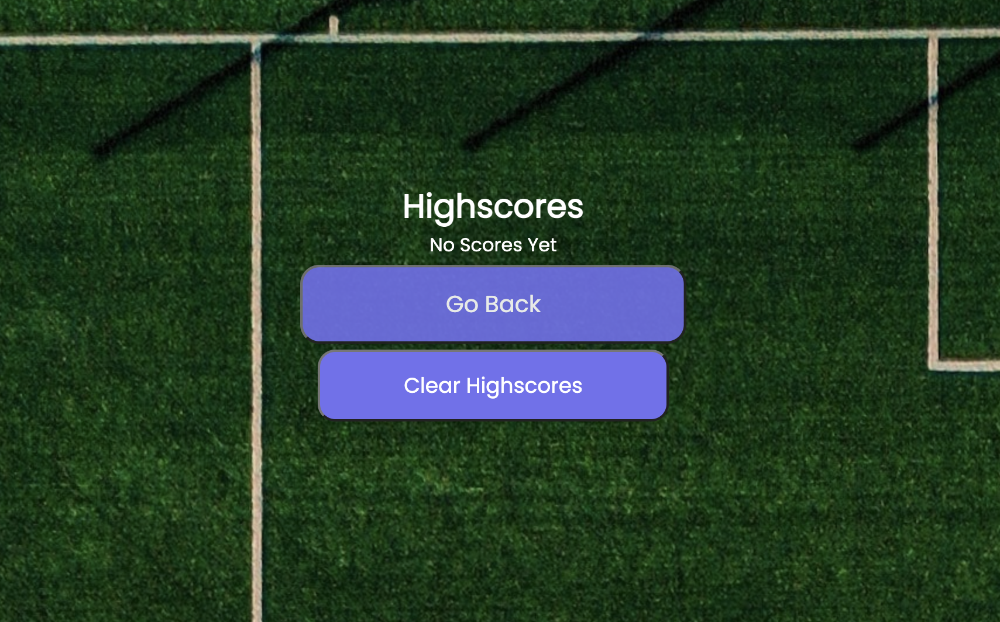

# Futbol-Javascript-Quiz

## Technology Used, Deployment, and Repository

| Technology Used         | Resource URL           | 
| ------------- |:-------------:| 
| HTML          | [https://developer.mozilla.org/en-US/docs/Web/HTML](https://developer.mozilla.org/en-US/docs/Web/HTML) |
| CSS           | [https://developer.mozilla.org/en-US/docs/Web/CSS](https://developer.mozilla.org/en-US/docs/Web/CSS) |
| Javascript    | [https://developer.mozilla.org/en-US/docs/Web/JavaScript](https://developer.mozilla.org/en-US/docs/Web/JavaScript) |   
| Git | [https://git-scm.com/](https://git-scm.com/)     | 
| Deployed Site | [https://shirvanyankaren.github.io/Futbol-Javascript-Quiz/](https://shirvanyankaren.github.io/Futbol-Javascript-Quiz/)     | 
| My Github Repository | [https://github.com/ShirvanyanKaren/Futbol-Javascript-Quiz](https://github.com/ShirvanyanKaren/Futbol-Javascript-Quiz)     | 

## Description
This project was encompassed creating a quiz application from scratch by utilizing CSS, HTML, and javascript. With the connection and application of all three programs, the goal was to ensure the quiz also meet the following criteria:


* WHEN I click the start button
* THEN a timer starts and I am presented with a question
* WHEN I answer a question
* THEN I am resented with another question
* WHEN I answer a question incorrectly
* THEN time is subtracted from the clock
* WHEN all questions are answered or the timer reaches 0
* THEN the game is over
* WHEN the game is over
* THEN I can save my initials and my score the initials and score in the localStorage

The finished quiz application is presented below:


## Table of Contents

* [HTML, CSS, and Javascript](#javascript)
* [Usage](#usage)
* [Learning Points](#learning-points)
* [Credits](#credits)
* [License](#license)

## HTML, CSS, and Javascript

The first course of action for this project required the integration of html and css for the layout of each individual page of the quiz. Throughout this process, I also applied ids to the html elements to manipulate them in javascript later.

```html
 <nav id="welcomePage">
                <h2>This is a Quiz to Test Your Futbol Knowledge!</h2>
                <div><button id="start" >Start Quiz</button></div>
                <div><button id="highscores">View Highscores</button></div>
</nav>

<div id="gameEndPage">
                    <div id="result">Your score is: <span id="score">0</span></div>
                    <input type="text" placeholder="Enter you initials here" name="intials" id="initials"/>
                    <button id="submitScore">Submit Your Score</button>
</div>
```
The tags also helped align the different ids and divs in css. After completing the css and html layout, the next step was to connext these ids in javacript and create functions to meet all portions of the acceptance criteria.
```js
var questions = [
    {
      question: "When was the first World Cup?",
      choices: ["A. 1940", "B. 1965", "C. 1925", "D. 1930"],
      correctAns: "D. 1930",
    }, 
    // array of questions
    function showQuestions(){
    const currentQuestion = questions[questionIndex];
    questionList.textContent = currentQuestion.question;
    questionOptions.innerHTML = "";
    currentQuestion.choices.forEach(function(choice) {
        const li = document.createElement('li');
        const button = document.createElement("button");
        button.textContent = choice;
        li.appendChild(button);
        questionOptions.appendChild(li);
    });
    }
```
One of the most important and difficult parts of this project was appliyng the question object arrays to the quiz page. I accomplished this by declaring variables for the questions index and appending the the object array values such as the choices and questions. The rotation of these questions was then called upon in the following function guess that adds to the question index as long as it doesn't exceed the question array length. 

Another challenge of this project also included creating a localStorage to store user highscores and display them in order from greatest to smallest. I accomplished this by adding an event listener to the input form that asks for the user's initials and utilizing localStorage.setItem as follows:

```js
function afterSubmit() {
    const initialsInput = document.getElementById('initials');
    const initials = initialsInput.value.trim();
    if (initials !== "") {
      const scoreObject = { initials: initials, score: secondsLeft };
      scoreListArr.push(scoreObject);
      localStorage.setItem("scores", JSON.stringify(scoreListArr));
      displayHighScores();
    }
  }

  ...
    const storedScores = JSON.parse(localStorage.getItem("scores"));

```
After pushing all the important information for the highscore list onto the black array "scoreListArr", I utilized the local storage and converted the array into a JSON string that would then translated for javascript with JSON.parse(). 

I added the final touches to the project with the returnGame button and addressing the edge case of having an empty highscore array by adding "no highscores yet". 



## Learning Points

This project taught me a lot about a ton of new concepts like event listeners, object values, and manipulating html elements with java querry selectors. One of the most difficult things to learn and apply in this project was the localStorage. This included learning how to use setItem to store a calue in conjunction with JSON.stringify for nonstring values then using getItem and JSON.parse to return the values once we retrieve them. 

## Credits

I utilized the following resources for this project.

* [JSONparse](https://developer.mozilla.org/en-US/docs/Web/JavaScript/Reference/Global_Objects/JSON/parse)
* [JSONstringify](https://developer.mozilla.org/en-US/docs/Web/JavaScript/Reference/Global_Objects/JSON/stringify)
* [Storage](https://developer.mozilla.org/en-US/docs/Web/API/Web_Storage_API)
* [Object](https://developer.mozilla.org/en-US/docs/Web/JavaScript/Reference/Global_Objects/Object)
* [localStorage.setItem](https://developer.mozilla.org/en-US/docs/Web/API/Storage/setItem)

## License 

MIT licensing with permisions such as commercial use, modification, distribution and private use. Limitations include liability and warranty.
